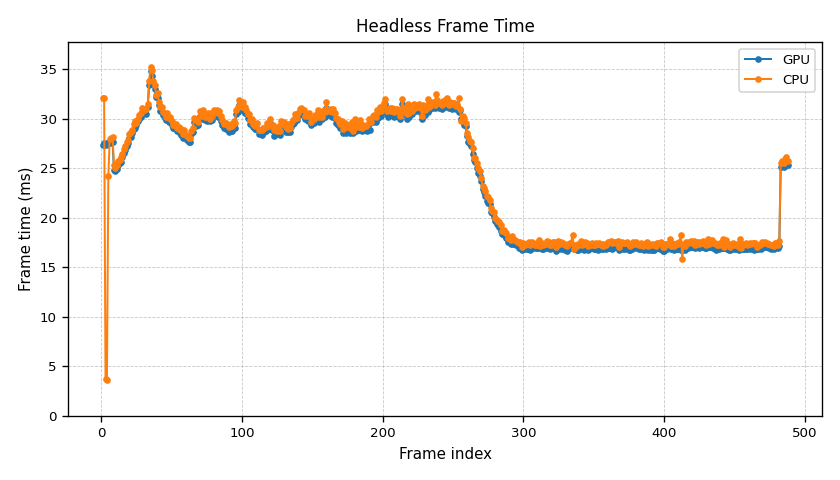
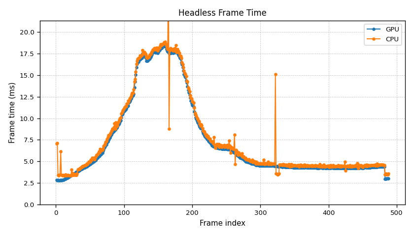
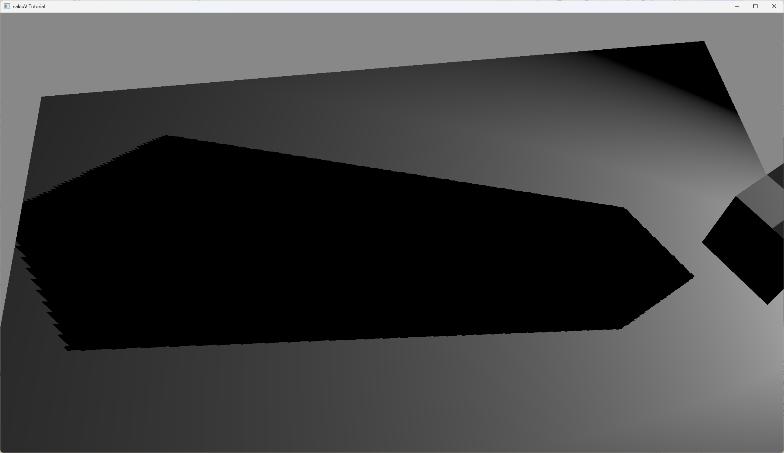
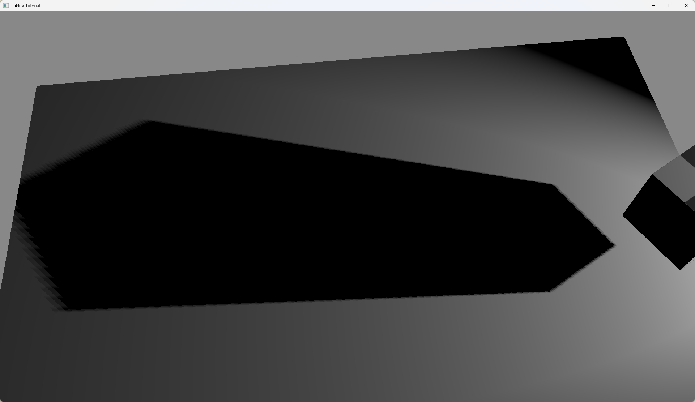
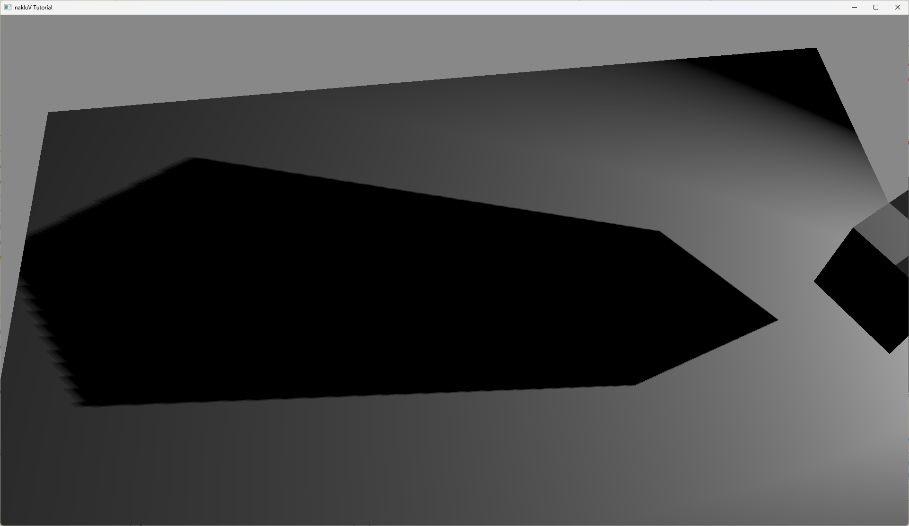
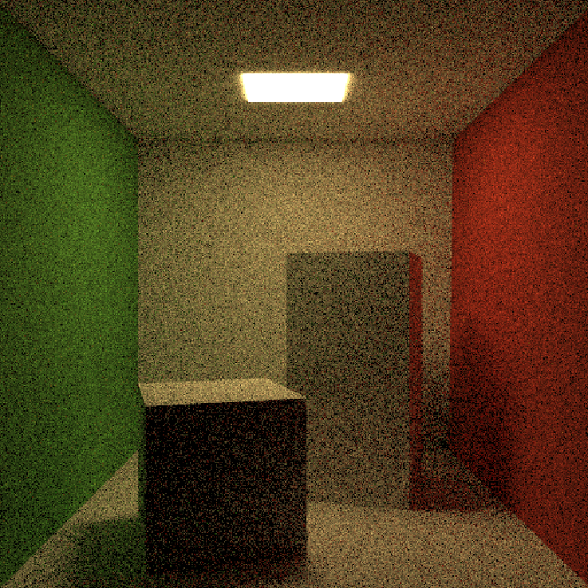
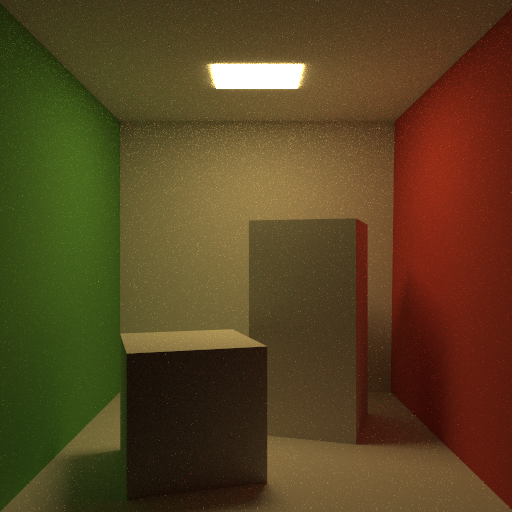
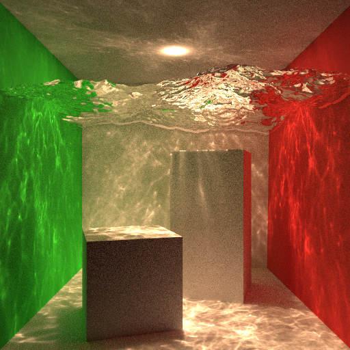

欢迎来到我的主页。这里集中展示了我在实时渲染、离线渲染和图形算法工程化方向的代表项目。

---

### MyVk

基于 Vulkan API 从零实现实时渲染器，重点覆盖显存管理、光照与阴影、可见性剔除等功能。

#### 屏幕空间 Light Culling

将屏幕按 x/y 方向划分为固定大小的 Tile。对每个光源，先将其影响半径投影到屏幕空间，再判断该投影与哪些 Tile 相交；相交即视为该光源会影响该 Tile。着色阶段仅遍历当前 Tile 的光源列表，从而减少无效光照计算。

<figure style="text-align: center;">
  <video style="width: 100%; height: auto;" controls>
    <source src="./assets/myvk-light-culling.mp4" type="video/mp4">
  </video>
  <figcaption>为了测试 Light Culling 准备的场景</figcaption>
</figure>

测试场景包含 48 块平面，每块平面带有 25 个 Sphere Light；相机沿动画路径移动，视野内光源数量从少量逐步增加到全部，以观察不同负载下的性能变化。

  

    
    
关闭 Light Culling

  

  

    
    
开启 Light Culling

  

性能分析显示，开启 Light Culling 后峰值 frame time 接近减半。在视野内光源较少的阶段，收益更明显，frame time 最低可降至未开启时的约十分之一，验证了分 Tile 光源筛选的有效性。

#### PCSS

Spot Light 与 Sphere Light 的阴影采样采用 PCSS。实现分为三步：
1. Blocker Search：在着色点邻域进行 20 次方向采样，统计遮挡体数量及平均深度。
2. Penumbra Estimation：根据遮挡体深度关系估算半影宽度。
3. PCF Filtering：依据半影宽度自适应调整 PCF 采样核，并进行 20 次均匀采样。

<figure style="text-align: center;">
  
  <figcaption >无滤波</figcaption>
</figure>

<figure style="text-align: center;">
  
  <figcaption >PCF 滤波</figcaption>
</figure>

<figure style="text-align: center;">
  
  <figcaption >PCSS 滤波</figcaption>
</figure>

三张图从上至下分别对应：无滤波、PCF、PCSS。无滤波时阴影边缘过硬；PCF 会对近处和远处阴影统一模糊；PCSS 则能表现“近处更锐利、远处更柔和”的半影变化，更符合真实光照观感。

#### Cascade Shadow Map

Sun Light 阴影采用 Cascaded Shadow Map（CSM）。先依据相机 Frustum 将可见范围划分为 4 个 Cascade，再为每个 Cascade 计算稳定包围球，并据此构建对应的正交投影矩阵生成 Shadow Map。

采样阶段为降低 Cascade 切换带来的边界跳变，我在层级过渡区同时采样相邻两级 Shadow Map，并按权重混合，最终实现平滑过渡。

<figure style="text-align: center;">
  <video style="width: 100%; height: auto;" controls>
    <source src="./assets/myvk-cascade.mp4" type="video/mp4">
  </video>
  <figcaption>不同层级 Cascade 无缝切换</figcaption>
</figure>

<figure style="text-align: center;">
  <video style="width: 100%; height: auto;" controls>
    <source src="./assets/myvk-cascade-debug.mp4" type="video/mp4">
  </video>
  <figcaption>Debug 视图下的 Cascade 层级选择</figcaption>
</figure>

#### PBR + IBL 光照管线
构建标准 PBR 光照管线，并基于 Epic 提出的 Split Sum Approximation 实现 IBL 预积分流程（Diffuse Irradiance + Specular Prefilter + BRDF LUT），显著提升环境光照的物理一致性。

<figure style="text-align: center;">
  <video style="width: 100%; height: auto;" controls>
    <source src="./assets/myvk-pbr.mp4" type="video/mp4">
  </video>
  <figcaption>PBR 着色管线</figcaption>
</figure>

<figure style="text-align: center;">
  
  <figcaption>最左侧为 Diffuse 项，后续为不同 Roughness Level 下的 Specular 项</figcaption>
</figure>

#### Frustum Culling 性能优化
基于相机 Frustum 与物体包围体（AABB/OBB）进行相交测试，提前剔除视锥外几何体，减少 CPU 端 Draw Call 提交与 GPU 无效像素开销。

<figure style="text-align: center;">
  <video style="width: 100%; height: auto;" controls>
    <source src="./assets/myvk-culling.mp4" type="video/mp4">
  </video>
  <figcaption>黄色线框为相机 Frustum，绿色线框为 AABB，蓝色线框为 OBB，红色线框为被剔除几何体</figcaption>
</figure>

#### Bindless Texture 资源绑定优化
将传统逐材质纹理绑定改为动态纹理数组 `Textures[]`，并通过 Push Constant 传递材质索引，在着色阶段按索引访问纹理，以降低 descriptor 切换频率。

代码片段：


layout(set=2, binding=1) uniform sampler2D Textures[];

layout(push_constant) uniform Push {
    uint MATERIAL_INDEX;
} push;


---

### Unity 6 + Compute Shader SSR

在 Unity 6 渲染框架下实现 Compute Shader 版本 SSR。通过分 Tile 调度与组内共享内存复用邻域采样数据，降低重复访存开销并提升反射追踪效率。

<figure style="text-align: center;">
  <video style="width: 100%; height: auto;" controls>
    <source src="./assets/unity-SSR.mp4" type="video/mp4">
  </video>
  <figcaption></figcaption>
</figure>

---

### MyPT（个人项目）

基于现代 C++ 实现离线渲染系统，围绕全局光照算法进行可验证实验。

#### 架构搭建

<figure style="text-align: center;">
  
  <figcaption >代码架构，参考自 PBRT v3</figcaption>
</figure>

#### NEE + MIS

传统 Path Tracing 在 Diffuse 表面主要依赖 Cosine-Weighted 方向采样。样本数不足时，直接光命中概率低，图像容易出现高频噪点。为此我引入 Next Event Estimation（NEE），在着色点显式采样光源；再通过 Multiple Importance Sampling（MIS）融合“光源采样”和“BSDF 采样”两类估计，在相同 spp 下获得更稳定的收敛效果。

  

    
    
原始 Path Tracing（256spp）

  

  

    
    
NEE + MIS（256spp）

  

#### Photon Mapping

为进一步提升 Diffuse 表面的间接光质量，我引入 Photon Mapping。算法采用两趟流程：
1. Photon Pass：从光源发射光子，构建 Global Photon Map 与 Caustic Photon Map。
2. Render Pass：主路径命中 Diffuse 表面时，查询两张 Photon Map 估计间接辐照度，补充高频间接光与焦散细节。

从结果对比不难看出，原始 Path Tracing（8h）仍有明显噪点；结合 Photon Mapping 的 Path Tracing（32spp，约 40min）可显著改善复杂间接光照质量。

  

    
    
原始 Path Tracing（8h）

  

  

    
    
Photon Mapping + Path Tracing（32spp，约 40min）

  

---

### Bernstein Bounds for Caustics, SIGGRAPH 2025

该工作提出面向焦散渲染的新方法，整体分为预计算与渲染两阶段，通过保守边界估计与重要性采样提升有效样本比例。

<figure style="text-align: center;">
  
  <figcaption >Bernstein Bounds for Caustics, SIGGRAPH 2025</figcaption>
</figure>

#### Python 到 C++ 的工程重构
我主要负责将算法原型从 Python 重构为现代 C++ 实现，并系统优化内存布局与多项式计算流程，实测性能与理论分析基本一致。

<figure style="text-align: center;">
  
  <figcaption >算法实现架构</figcaption>
</figure>

在架构上，抽象父类 Bounder 负责公共流程（预计算数据准备、栈空间初始化、结果输出）；BVP 类负责 Bernstein 基多项式初始化与边界计算，并通过随机测试验证数值可靠性。

实现优化方面，原始实现中多项式矩阵运算依赖运行期循环边界，分支与索引开销较高。针对固定光路类型（如一次反射/折射），我使用模板特化在编译期确定矩阵维度与循环范围，减少分支判断并提升流水线利用率。同时，约束方程在幂基下对应上三角矩阵，计算时可直接跳过下三角区域，综合带来接近 50% 的性能提升。

