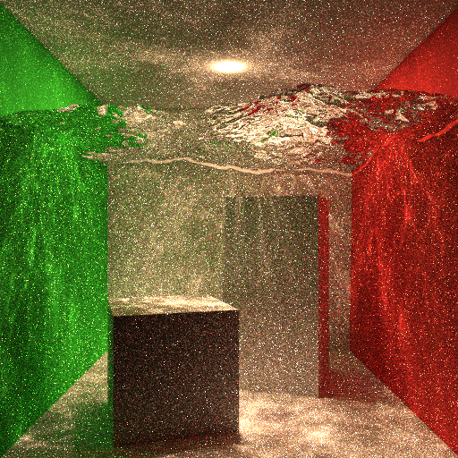
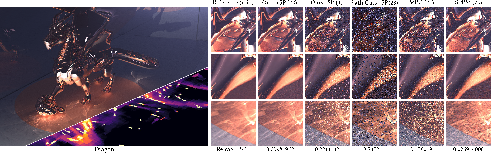
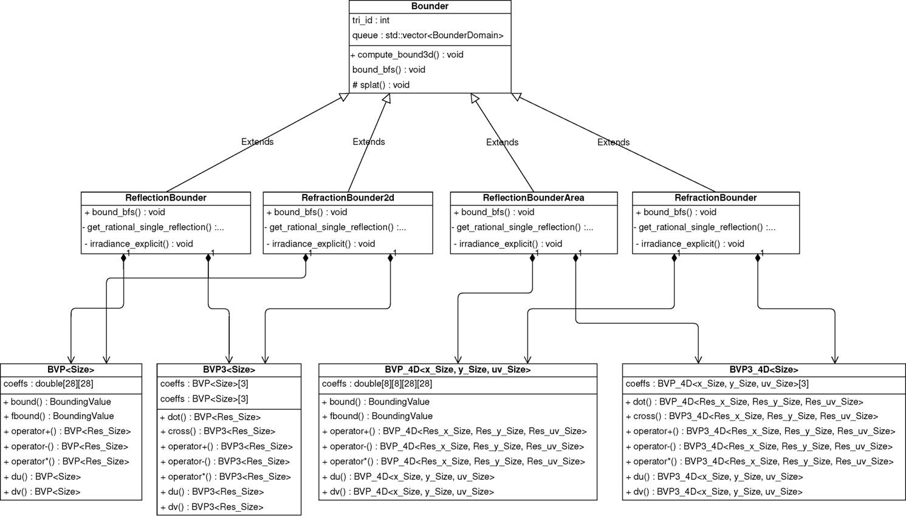

### MyVk

项目概述：基于 Vulkan API 从零构建实时渲染程序，重点实践显存管理、指令同步与渲染管线组织。

#### Frustum Culling 性能优化
核心实现：通过 Frustum Culling 剔除视区外几何体，降低 CPU Draw Call 与 GPU 渲染负载。

    <video width="100%" controls>
    <source src="./assets/myvk-culling.mp4" type="video/mp4">
    </video>

结果说明：黄色线框为相机 Frustum，绿色线框为 AABB，蓝色线框为 OBB，红色线框为被剔除几何体（剔除计算基于 AABB）。

#### Bindless Texture 资源绑定优化
核心实现：将纹理绑定改为动态数组 `Textures[]` + Push Constant 索引方式，实现 Bindless Texture。

代码片段：


layout(set=2, binding=1) uniform sampler2D Textures[];

layout(push_constant) uniform Push {
    uint MATERIAL_INDEX;
} push;


#### PBR + IBL 光照管线
核心实现：构建 PBR 光照管线并集成 IBL 预积分器，提升场景环境光真实感。

    <video width="100%" controls>
    <source src="./assets/myvk-pbr.mp4" type="video/mp4">
    </video>

    

结果说明：RGBE 编码格式预积分结果中，最左侧为 Diffuse 项，后续为不同 Roughness Level 下的 Specular 项。

#### 其他能力点

1. CSM + PCSS 阴影方案：通过 CSM 缓解透视走样，并用 PCSS 优化 Spot Light / Sphere Light 阴影，实现动态软阴影。
2. 屏幕空间 Light Culling：仅计算有效光源，提升多光源场景性能。

材料：A3 report（待补充链接）。

MyVk 关键实现总结：
1. Frustum Culling 减少无效渲染提交。
2. Bindless Texture 降低纹理绑定开销。
3. PBR + IBL 提升光照真实性。
4. CSM + PCSS 与 Light Culling 强化阴影与多光源性能。

---

### Unity 6 + Compute Shader SSR

项目概述：在 Unity 6 渲染框架下实现 Compute Shader 版本 SSR，优化反射质量与光线步进效率。

关键实现：
1. 接入 Unity 6 渲染 API，完成 SSR 计算阶段接入。
2. 通过 Compute Shader 重构屏幕空间反射流程，减少无效步进。

材料：ETC desktop（待补充链接）。

---

### MyPT（个人项目）

项目概述：基于现代 C++ 构建离线渲染系统，围绕全局光照算法验证 PBR 理论。

关键实现：
1. PBRT 风格模块化架构：拆分几何、材质、积分器等子系统，提升全局光照算法拓展性。
2. NEE + MIS 收敛优化：加速 Diffuse 材质直接光照收敛，减少高频噪点。
3. Photon Mapping 间接光照：弥补纯路径追踪在高频信号下的局限，高效计算复杂间接光照。

材料：架构图、基础光追 32spp vs NEE 32spp（待补充）。

    

    

结果对比：纯 Path Tracing（8h）仍有明显噪点；结合 Photon Mapping 的 Path Tracing（32spp，约 40min）可显著改善复杂间接光照质量。

---

### Bernstein Bounds for Caustics, SIGGRAPH 2025

项目概述：论文提出面向焦散渲染的新算法，分为预计算与渲染两个阶段，通过保守边界与重要性采样提升采样效率。

    

#### Python 到 C++ 的工程重构
我的贡献：将算法原型由 Python 重构为现代 C++，优化内存与计算逻辑，实测性能贴合理论预期。

    

架构说明：抽象父类 Bounder 负责公共流程（预计算数据准备、栈空间初始化、结果输出）；BVP 类负责 Bernstein 基多项式初始化与边界计算，并通过随机数测试验证可靠性。

    
展开查看模板特化优化细节

    在原始实现中，多项式运算大量依赖运行期确定边界的 for 循环矩阵计算，分支预测开销明显。针对固定高光路径类型（如单次反射/折射），可在编译期通过模板特化确定矩阵维度与循环边界，使代码更接近顺序执行，提升流水线效率。

    另外，约束方程在计算边界前使用幂基多项式，其矩阵天然为上三角结构。模板特化时可省略下半矩阵计算，带来接近 50% 的性能提升。

